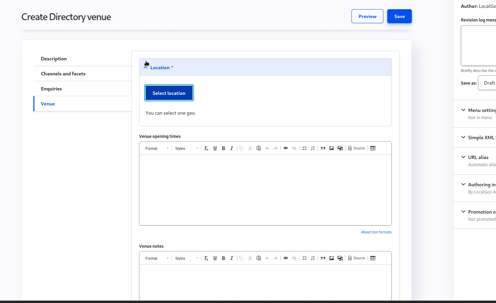

# Directories

[[toc]]

## When to use Directories

Directories provide a way to present content as a list which can be searched and filtered by your users. They are best used when:

* You have a type of content with a large volume of variations. Car parks, sports facilities, or parks are good examples
* Users are looking for content based on their needs and these can be described as a series of attributes such as _price range_ or _sports catered for_.
* Your content is related to a specific geographical location which is relevant to users

### Video guide 

Please see this video guide by content designer Ben Hills-Jones.

<iframe width="560" height="315" src="https://www.youtube.com/embed/FnpFlQyYdO8" title="YouTube video player" frameborder="0" allow="accelerometer; autoplay; clipboard-write; encrypted-media; gyroscope; picture-in-picture" allowfullscreen></iframe>

## Examples in the wild
These examples may have code and themes that are different to the LocalGov Drupal core. 

* [Croydon: Secondary schools](https://www.croydon.gov.uk/schools-and-education/schools/find-school-near-you/secondary-schools)
* [Lambeth: Libraries](https://beta.lambeth.gov.uk/libraries-0)

## Essential concepts

### Directory Facets

Facets are groups of attributes users will filter by when looking for a Directory Item(s). Each Facet type should be made up of at least 2 Facets, each of which can apply to 1 or more Directory Items. As an example, when searching for a school, there are a variety of attributes (Facets) which users will be interested in when looking for one that fits their needs. This is illustrated well by [Croydon's Secondary school Directory](https://www.croydon.gov.uk/schools-and-education/schools/find-school-near-you/secondary-schools):

Note Not all Facet types are made up of mutually-exclusive Facets. In the case of gender most schools are applicable to both _Girls_ and _Boys_ where as other schools are only applicable to one gender.

There are also often cases where Facets will be mutually exclusive such the maximum length of stay for car parks:

**Maximum stay (Directory Facet type)**
* 1 hr (Directory facet)
* 2 hrs (Directory facet)
* 4 hrs (Directory facet)
* 6 hrs (Directory facet)

### Directory Channels

Directory Channels are the way to display your directory. A Directory Channel is the the page where users will be presented with a list of Directory Items with a free text search box or to filter by Facets. 

Directory Channels automatically provide a logical information architecture. For example, consider a Directory Channel with a URL of `/schools/find-a-school/secondary-schools` and a breadcrumb of `Schools > Find a school > Secondary schools`; each Directory Item will then have a URL and breadcrumb based on its _Primary Channel_, e.g.  _Scarfolk High School_ would have the URL `/schools/find-a-school/secondary-schools/scarfolk-high-school` and breadcrumb `Schools > Find a school > Secondary schools > Scarfolk High School`.

As an editor, Channels give you the flexibility to compose a Directory made up of 1 or more types of Directory Item which can be filtered by 1 or more Directory Facet types.

### Directory Items

Directory Items are pieces of content, and pages, in their own right but also a member of 1 or more Directory Channels. For example, a _School_ content type could allow editors to 
* publish detailed information on individual schools
* be listed to the _Secondary schools_ Channel.

LocalGov Drupal comes with some generic Directory Item types which can be used as-is or can be extended to meet your needs:

| Type      | Uses |
| ----------- | ----------- |
| Page      | General purpose.        |
| Venue  | Sports facilities; parks. Provides location integration. |
| Organisation | Libraries; Schools; Provides location integration.  |

Alternatively, LocalGov Directories provides site-builders with a toolkit to create bespoke Directory Item types without having to write any code. More information about customizing Directory Items can be found in the [Directories Technical documentation](/devs/features/directories-technical).

As a minimum a Directory Item must belong to a _Primary_ Channel, and this can be any Channel which accepts Directory Items of that type e.g. School. The _Primary_ Channel is required as it is the basis for the inferred URL and breadcrumb (as described above). Items may also belong to multiple _Other_ Channels, these additional Channels do not influence the URL or breadcrumb but will include the Item in its list and do still impact the available Facets (as described below).

In order to allow users to filter Directory Items by Directory Facets, Items must be 'tagged' with the appropriate Facets. When creating\editing an Item, the available Facets is determined by the Channels it belongs to. For example, consider the following Channels:

**Sports facilities**

* Facet types: Sports, Location
* Content types: Sports venue

**Secondary schools**

* Facet types: Age, Location
* Content types: School

When creating\editing _Sports venue_ Directory Items _Sports_ and _Location_ facets can be selected while with _Schools_ the _Age_ and _Location_ facets will be available.  

## How-to

### Create a Directory of schools

In this guide we'll step through the process to create a Directory of secondary schools using features which come out-of-the-box with LocalGov Drupal.

#### Pre-requisites

* You'll need to have access to a Drupal installation based on the LocalGov install profile.
* The following Drupal modules will need to be installed: LocalGov Directories, LocalGov Directories Location and LocalGov Directories Organisation.
* You'll need to be able to log in with a user which has editorial rights.

#### Creating the Facet types

We'll create two Facets types which allow users to filter secondary schools by the type of school and the age range.

Once you've logged in navigate to the Facets types overview page via the menu items _Content_ > _Directory Facets_ > _Add directory facet type_

From this screen, enter 'Age' into the _Label_ field and click _Save directory facets type_. You'll be taken to the types overview page where you can see your new type.

From here, click _Add directory facets type_ button to create another. This time, enter 'Location' into the _Label_ field and click the save button.

#### Creating the Facets

With our Types in place, it's time to create the Facets which users can use to filter our list of schools. Using the admin menu, choose _Content_ > _Directory Facets_ > _Add directory facet_

From the next screen choose the previously created _Age_ Type and, finally, enter '11 to 16 years' into the _Title_ field and click the _Save_ button. You'll be taken to the Facet overview screen.

From here, click the _Add directory facets_ button and repeat the process until you have the following:

| Age      | Location |
| ----------- | ----------- |
| 11-16 years      | North Somewhere       |
| 11-18 year   | South Somewhere        |

#### The Channel

OK we're getting somewhere. Next up let's create a 'Channel'. Remember, the purpose of this channel is to allow users to filter a list of secondary schools by age and location so they can find a school which meets their criteria. Here we're going to make use of the _Directory organisation_ content type, that comes out-of-the-box with LocalGov Drupal, to represent a school.

Using the admin menu, navigate to _Add content_ > _Directory_ > _Directory channel_:

From this screen, enter 'Secondary schools' into the _Title_ field and then scroll down the page and check all the boxes under _Enabled Content types_ and _Enabled facets_.

Finally, click _Save_ to create your new Channel.

#### Directory Items

With the Channel and Facets in place we are ready to start creating some Directory Items, in this case secondary schools.

Using the admin menu, navigate to _Add content_ > _Directory_ > _Directory organisation_:

From here, enter 'Example high school' into the _Title_ field then select the _Channels and facets_ tab. After selecting 'Secondary schools' as the _Primary_ Channel you will be presented with some Facets for selection. Choose some Facets, in this case it probably doesn't make sense to have more than one Facet per Type:

#### Item location

Finally, we can harness the power of the LocalGov Drupal location integration so users can browse the schools by using a map interface. Open the _Venue_ tab and click the _Select location_ button. From the popup, choose the _Create new address_ tab. Populate the fields within the _Address_ tab with an address familiar to you:

The address should autocomplete if your site is configured to do so, and it will place the point on the map. If this is incorrect, or not found, you can place the point manually.

Finally, scroll to the bottom fo the popup and click the _Save address_ button and then save the venue.

You'll probably want to repeat this process a few times, choosing different combinations of Facets and different addresses, in order to better understand how Directories work.

#### Using the Channel

With your newly entered Directory Items it's time to experiment with the Channel to see what it can do. Navigate to the content overview page via the admin menu. From here, you'll be able to see your Channel and Items. Click on the Channel name to view the Channel page:

As you'll see, by choosing Facets and entering a location the Directories module has automatically generated the filters and map visualisation. Try selecting different facets to see how it effects the listed schools.
