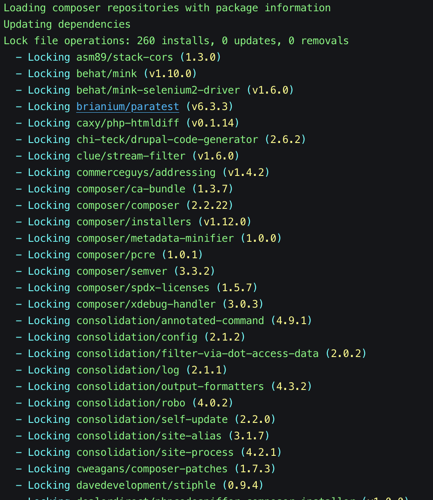
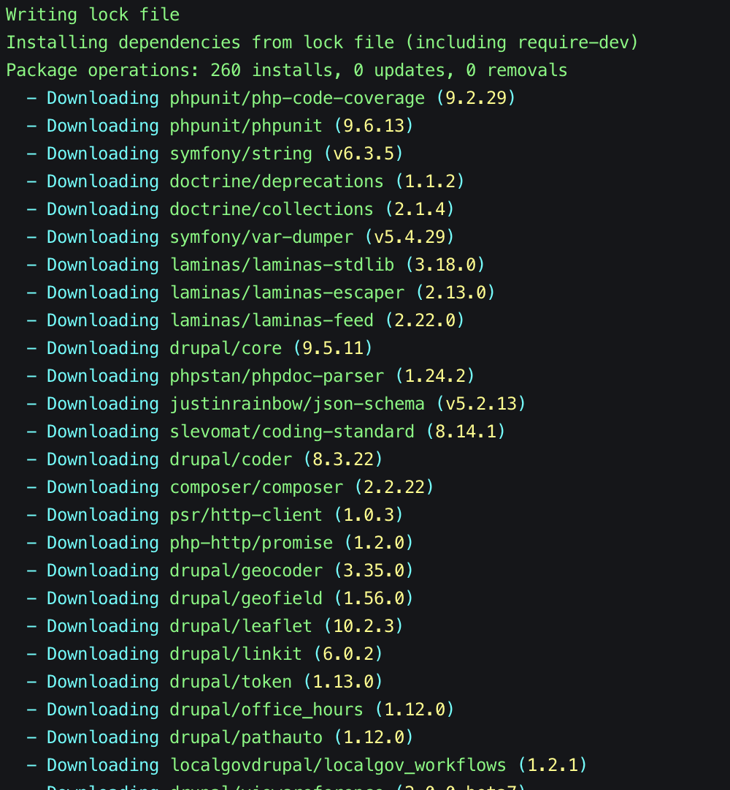
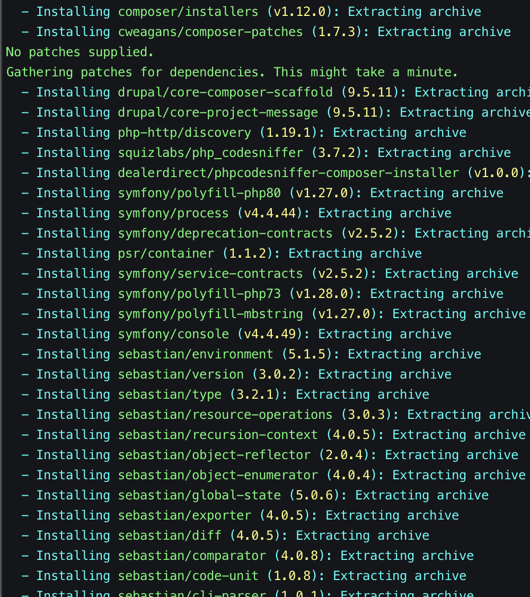
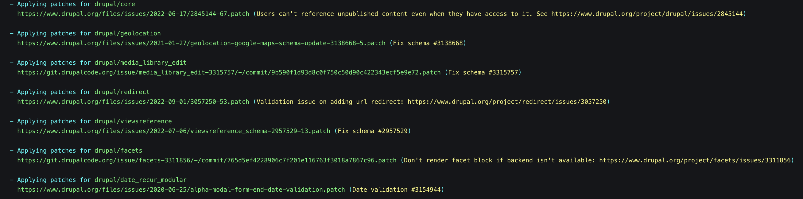
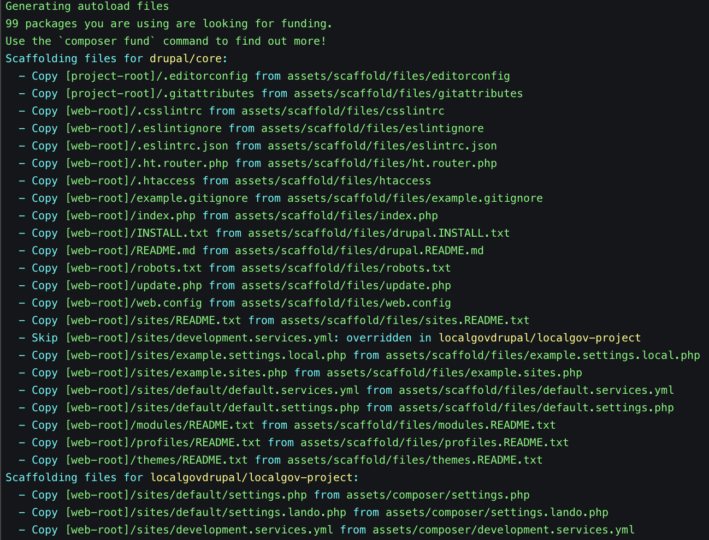
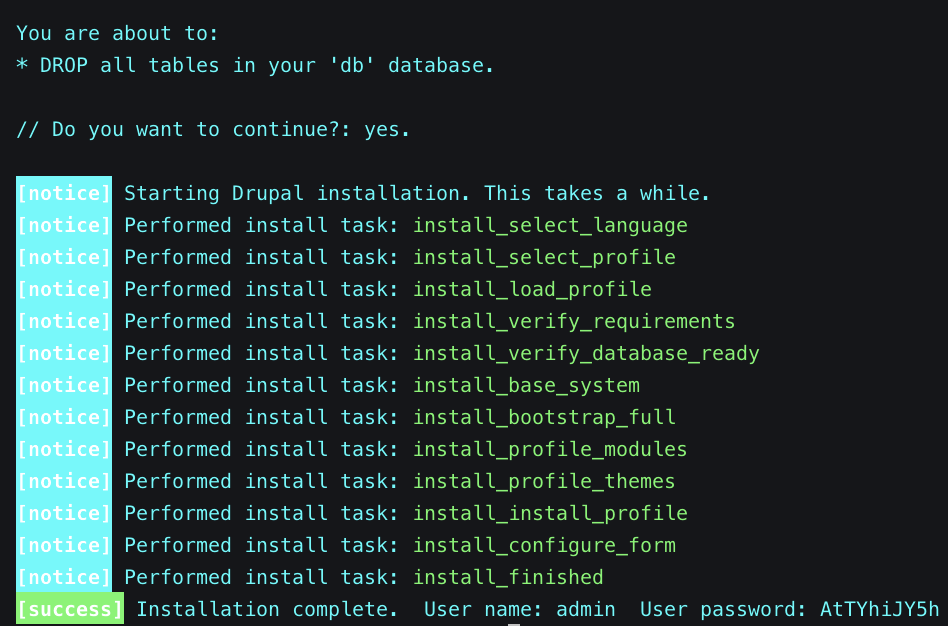
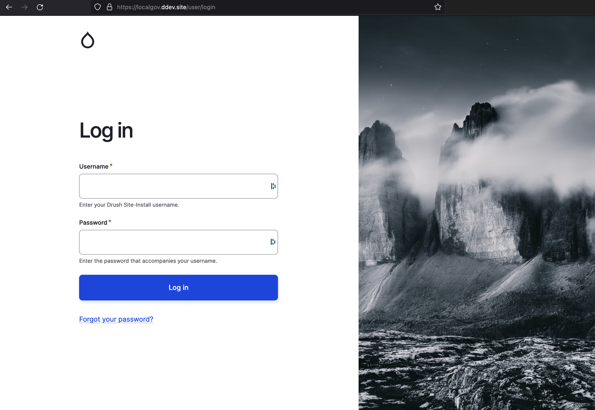
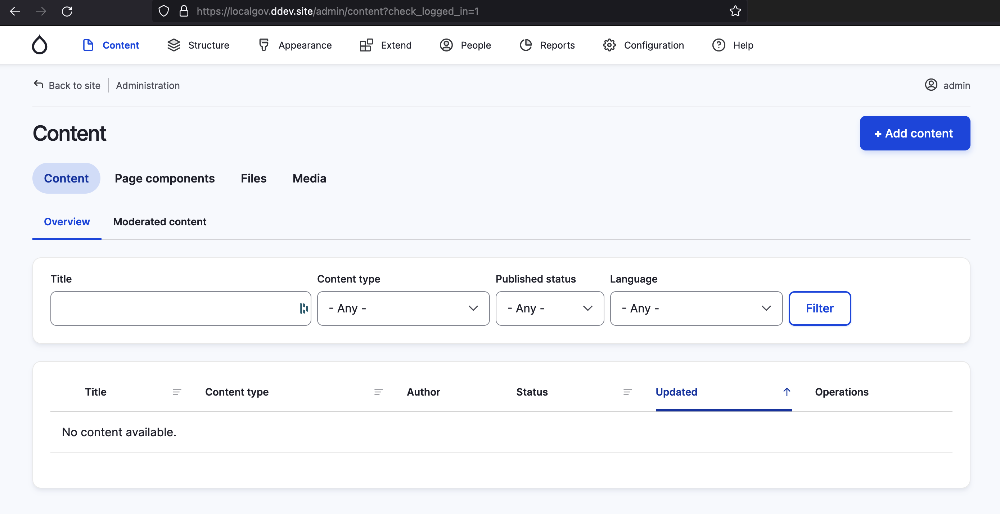

---
tags:
  - local development
  - DDEV
  - docker
  - composer
---

# Working with DDEV

## DDEV Installation

<a href="https://ddev.com/">DDEV</a> is an Open Source tool for launching local web development environments in minutes.
These environments can be extended, version controlled, and shared, so you can take advantage of a Docker workflow
without Docker experience or bespoke configuration.

The Drupal community selected DDEV as the [recommended local Drupal development tool](https://www.drupal.org/docs/getting-started/installing-drupal/install-drupal-using-ddev-for-local-development) in June 2024.

The [DDEV requirements page](https://docs.ddev.com/en/) offers detailed information on the
prerequisites that should be in place but, generally speaking, here's a list of minimum requirements for DDEV:
- Recent OS version
- RAM: 8GB
- Storage: 256GB

There are multiple ways of installing DDEV locally, mainly depending on your Operating System.

Please follow the [DDEV installation instructions](https://docs.ddev.com/en/stable/users/install/) for your Operating System, whether it is macOS, Linux, or Windows.

## Installing LocalGov Drupal locally with Composer and DDEV

Composer (see [Getting Started](/devs/getting-started/)) is included in DDEV. It is not recommended to install
[PHP or Composer on the host machine](https://docs.ddev.com/en/stable/users/usage/faq/#do-i-need-to-install-php-composer-nginx-or-nodejsnpm-on-my-workstation)
to prevent conflicting versions.

Now that we have all the required dependencies in place (Composer, Docker and DDEV), we can create our first
LocalGov Drupal project locally.

Switch to an appropriate directory (for example the `~/Sites` folder on macOS) via the command line:

```bash
cd ~/Sites
```

### 1. Setting up DDEV

First, we need to set up DDEV for LocalGov Drupal in a new directory, for example called `localgov`:

```bash
mkdir localgov
cd localgov
```

Then, we need to initialise our DDEV project:

```bash
ddev config --project-type=drupal10 --docroot=web
ddev start
```

All required resources are pulled in, and the containers start running.

You can verify everything is working, and see all services with the DDEV `describe` command:

```yml
$ ddev describe
┌──────────────────────────────────────────────────────────────────────────────────────────────────────┐
│ Project: localgov ~/dev/localgov https://localgov.ddev.site                                          │
│ Docker platform: linux-docker                                                                        │
│ Router: traefik                                                                                      │
│ DDEV version: v1.24.10                                                                               │
├──────────────┬─────────┬────────────────────────────────────────────────────────┬────────────────────┤
│ SERVICE      │ STAT    │ URL/PORT                                               │ INFO               │
├──────────────┼─────────┼────────────────────────────────────────────────────────┼────────────────────┤
│ web          │ OK      │ https://localgov.ddev.site                             │ drupal10 PHP 8.3   │
│              │         │ InDocker -> Host:                                      │ Server: nginx-fpm  │
│              │         │  - web:80 -> 127.0.0.1:32768                           │ Docroot: 'web'     │
│              │         │  - web:443 -> 127.0.0.1:32769                          │ Perf mode: none    │
│              │         │  - web:8025 -> 127.0.0.1:32770                         │ Node.js: 20        │
├──────────────┼─────────┼────────────────────────────────────────────────────────┼────────────────────┤
│ db           │ OK      │ InDocker -> Host:                                      │ mariadb:10.3       │
│              │         │  - db:3306 -> 127.0.0.1:32772                          │ User/Pass: 'db/db' │
│              │         │                                                        │ or 'root/root'     │
├──────────────┼─────────┼────────────────────────────────────────────────────────┼────────────────────┤
│ xhgui        │ stopped │ https://localgov.ddev.site:8142                        │                    │
│              │         │ InDocker:                                              │                    │
│              │         │  - xhgui:80                                            │                    │
│              │         │ Launch: ddev xhgui                                     │                    │
├──────────────┼─────────┼────────────────────────────────────────────────────────┼────────────────────┤
│ Mailpit      │         │ Mailpit: https://localgov.ddev.site:8026               │                    │
│              │         │ Launch: ddev mailpit                                   │                    │
├──────────────┼─────────┼────────────────────────────────────────────────────────┼────────────────────┤
│ Project URLs │         │ https://localgov.ddev.site, https://127.0.0.1:32769,   │                    │
│              │         │ http://localgov.ddev.site, http://127.0.0.1:32768      │                    │
└──────────────┴─────────┴────────────────────────────────────────────────────────┴────────────────────┘
```

Every time DDEV starts, the project URLs are included in the output. In our case, we have selected _localgov_ as the
name of our project and, as a result, https://localgov.ddev.site will be the first URL we can access our project on.
Our machine's localhost IP (like `127.0.0.1:32768`) and an available port allocated to our DDEV
project is also available. Both URLs can be used to access our project on our browser.

**Note**: The LocalGov Drupal project will not be accessible via those URLs until you have created it, see below.

At any point (when you're done for the day, for example), you can stop the project and remove its memory usage by running:

```bash
ddev stop
```

Once DDEV has been initialised, you might also want to run:

```bash
ddev auth ssh
```

... in order to enable your SSH keys for this project (this is useful for SSH authentication in case access to remote
repositories is required). The output of this command lists all the SSH keys our container has been made aware of.


### 2. Creating the Project

We are going to use the LocalGov Drupal project template publicly available
on [GitHub](https://github.com/localgovdrupal/localgov_project) and [Drupal.org](https://www.drupal.org/project/localgov).

To build the LocalGov Drupal project locally, we use Composer to bring all the required packages together:

```bash
ddev composer create localgovdrupal/localgov-project
```

All Composer packages for this project will be downloaded. This can take a while, as the command downloads all the
necessary packages from their corresponding repositories.

Below are the main phases of the process (you can read more about how Composer
actually manages and installs dependencies on the
[corresponding Composer documentation page](https://getcomposer.org/doc/01-basic-usage.md#installing-dependencies)).

#### 1. Locking dependencies to their defined versions



#### 2. Downloading the locked dependencies



#### 3. Installing the downloaded dependencies



#### 4. Applying patches

(These have also been pre-defined in the LocalGov Drupal Composer template.)



#### 5. Scaffolding files

(Scaffolding is a fancy name for putting certain key Drupal files and their contents in place).




### 4. Building the Site with Drush

We can now finally install our site using the site install drush command (for more on drush, Drupal's popular scripting
tool, see [Drush](https://www.drush.org)):

```bash
ddev drush site:install localgov -y
```

The output of the command will look something like the following:



Our new LocalGov Drupal site is now up and running locally!

To log in to your Drupal administrator account on your brand new LocalGov Drupal site, run this commmand
to create a one time login link for the admin user:

```bash
ddev drush user:login
```

Alternatively, open https://localgov.ddev.site/ and manually enter the credentials returned from the
`drush site:install` command here:



Logging into your admin account will land you on the Drupal content page:



Your brand new LocalGov Drupal site is now up and running locally with DDEV. From here, you can explore all the unique
features that come with LocalGov Drupal out of the box and start building your new Council website!

To check out all the features, you can create a demo site, by installing the LocalGov Demo module:

```bash
ddev drush install localgov_demo
```
